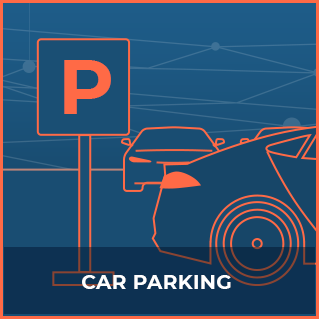
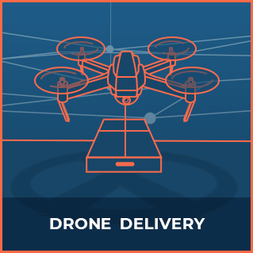
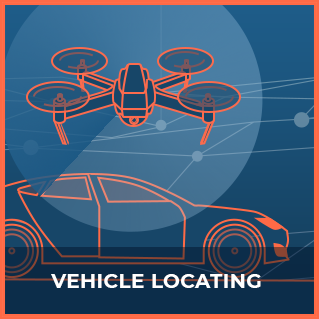

Welcome to the DAV communication protocols API documentation.

Here you will find the different protocols governing communication between the different vehicles, services, users, and applications using DAV.

# Communication Protocols

<ul class="main-thumbs">
  <li></li>
  <li></li>
  <li></li>
  <li></li>
  <li></li>
  <li></li>
  <li></li>
</ul>
